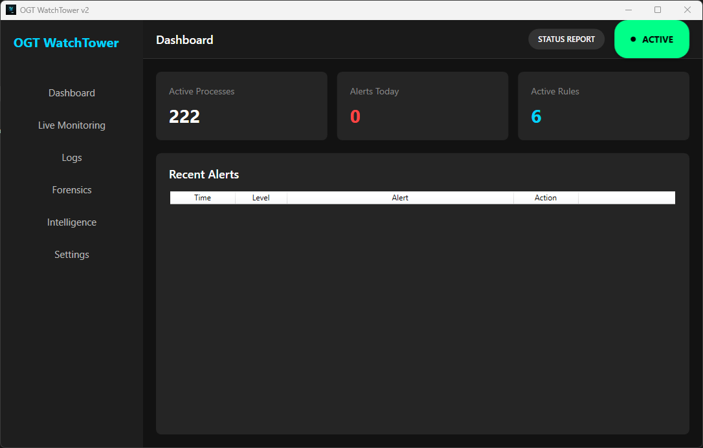
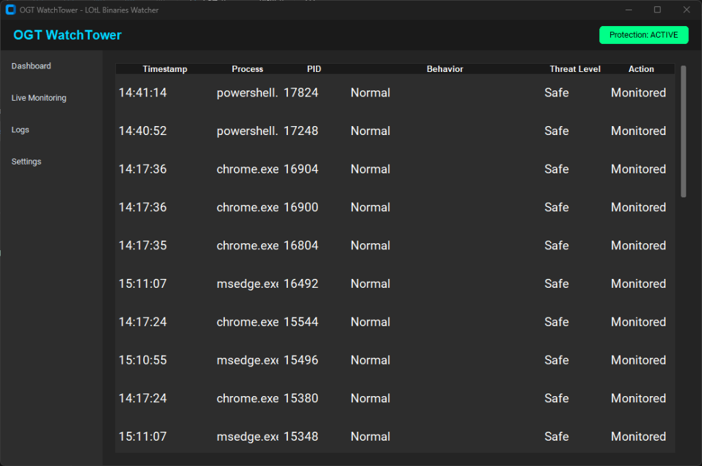
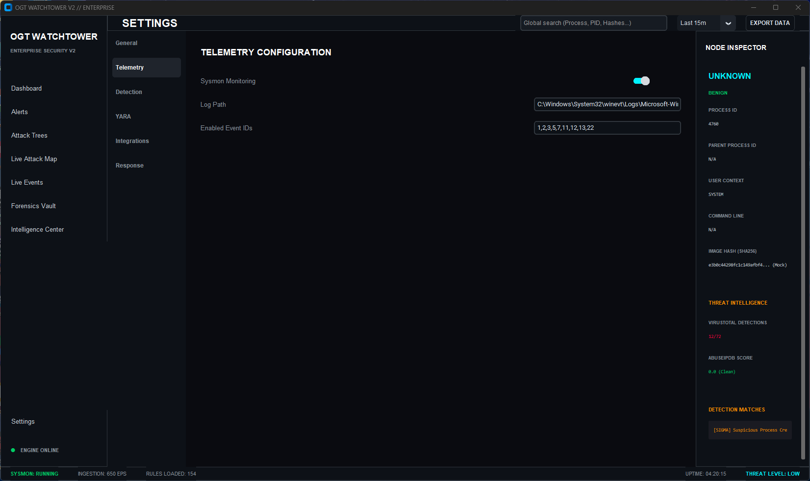
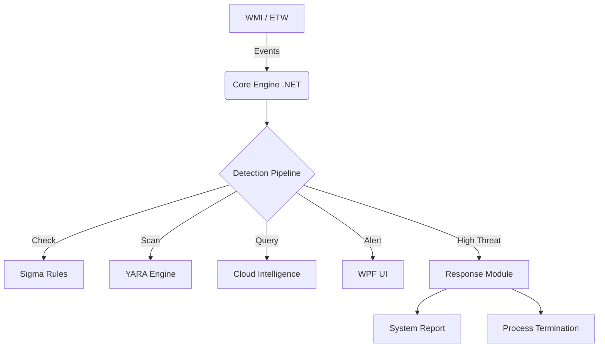

# 🛡️ OGT WatchTower v2

**Advanced Behavioral Protection Platform**

> "Watching What Others Miss" - Kernel-level visibility to detect and prevent Living-off-the-Land (LOLBin) attacks.

[](LICENSE)
[](https://www.microsoft.com/windows)
[](https://dotnet.microsoft.com/download/dotnet/10.0)


## 🚀 What's New in v2?

Version 2 represents a complete rewrite in **C# / .NET 10** for maximum performance and native system integration:

-   **High-Performance Engine**: Native .NET implementation drastically reduces overhead compared to previous versions.
-   **Modern WPF Interface**: A completely new, polished UI with dark mode, fluent design, and real-time animations.
-   **Enhanced Detection**: Improved Sigma Rule engine with support for complex condition matching.
-   **System Health Reports**: Generate comprehensive PDF-style reports on system security status and threat history.
-   **Smart Response**: Tiered response capabilities (Auto-Kill for High/Critical threats, Auto-Suspend for others).
-   **Zero-Config Deployment**: Self-contained executable with no external dependencies required.

## 📑 Table of Contents

-   [Features](#-features)
-   [Installation](#-installation)
-   [Usage](#-usage)
-   [Configuration](#-configuration)
-   [Architecture](#-architecture)
-   [Screenshots](#-screenshots)

## ✨ Features

### 🔍 Advanced Detection
-   **Real-time Event Stats**: Monitors Process Creation with kernel-level precision using WMI/ETW.
-   **Sigma Rule Support**: Compatible with industry-standard Sigma rules (`.yml`) for threat detection.
-   **YARA Scanning**: Integrated YARA engine to verify binary identity and detect masquerading malware.

### 🛡️ Automated Response
-   **Tiered Protection**:
    -   **Auto-Kill**: Instantly terminates High and Critical severity threats (e.g., encoded PowerShell).
    -   **Auto-Suspend**: Suspends suspicious processes to allow for forensic investigation.
-   **Forensic Snapshots**: Captures process metadata and state before termination.

### 🌐 Threat Intelligence
-   **Cloud Sentry**: Integration with VirusTotal and AbuseIPDB for real-time reputation checking.
-   **System Health Reporting**: One-click generation of security status reports.

## 💿 Installation

### Prerequisites
-   **Windows 10/11** (64-bit)
-   **Administrator Privileges** (Required for process monitoring and termination)

### Step 1: Run WatchTower
1.  Navigate to the `release/` folder.
2.  Double-click `OGT.WatchTower.App.exe` (Run as Administrator).

### Step 2: Verify Protection
Run the included simulation script to test defenses:
```powershell
./simulate_attacks/simulate_attack.bat
```

## 🚀 Usage

### The Command Center
The new WPF GUI provides a real-time view of your system's security posture:
-   **Live Feed**: Watch every process creation event with color-coded threat levels.
-   **Alerts**: High-priority threats appear in the alerts section with immediate action buttons.
-   **Dashboard**: Track total events, threats, and system health status.

### System Reports
Click the **Report** button (left of Active button) to generate a detailed system health report showing:
-   Current Security Status (SECURE / AT RISK)
-   Latest Threat Details (Name, Severity, Location, Impact)
-   Action Taken (e.g., PROCESS TERMINATED)

## 📸 Screenshots

### Main Dashboard

*Real-time monitoring dashboard with threat statistics and status indicators*

### Live Monitoring Panel

*Active process monitoring with threat level indicators and modern data grid*

### Settings & Configuration

*Granular control over protection sensitivity and automated responses*

## ⚙️ Configuration

Edit `config/settings.json` in the release folder to enable features and add API keys:
```json
{
    "Response": {
        "AutoKill": true,
        "AutoSuspend": true
    },
    "ApiKeys": {
        "VirusTotal": "YOUR_KEY_HERE",
        "AbuseIPDB": "YOUR_KEY_HERE"
    }
}
```

Add your custom detection rules to `config/rules/*.yml`.

## 🏗️ Architecture



## � File Structure

```text
/
├── assets/                 # Icons and Screenshots
├── release/                # Production-ready executable and config
│   ├── config/             # Detection rules and settings
│   └── OGT.WatchTower.App.exe
├── simulate_attacks/       # Attack simulation scripts
├── src/                    # Source code
├── README.md               # Documentation
└── SECURITY.md             # Security policy
```

## 📄 License
MIT License - Copyright © 2026 OGT (Omar Al Tamimi).
